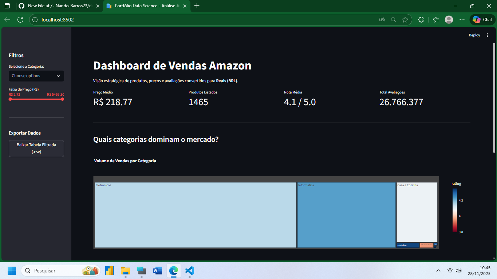
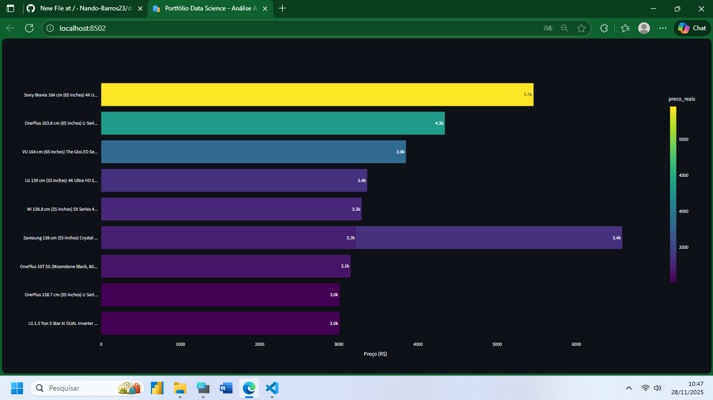
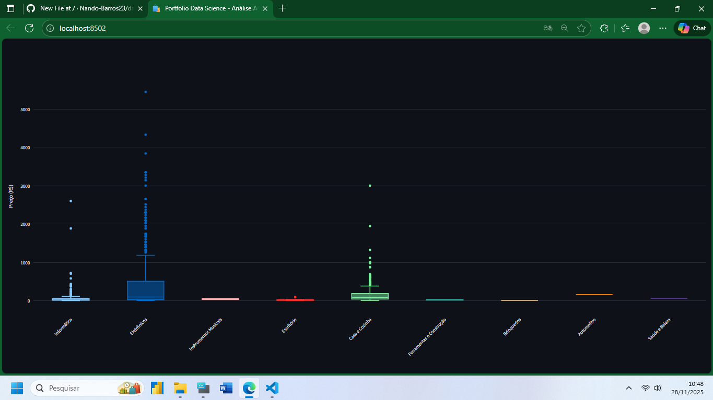

# Amazon Sales Dashboard - Análise de Dados

Projeto de análise de dados desenvolvido em Python, focado no tratamento e visualização de vendas de e-commerce. O objetivo foi processar um dataset bruto da Amazon, realizar a limpeza e normalização dos dados e apresentar insights estratégicos através de um dashboard interativo.

## Funcionalidades e Tratamento de Dados

O script realiza um processo de ETL (Extract, Transform, Load) antes da visualização:

* **Limpeza de Dados:** Remoção de caracteres especiais de moeda e conversão de strings para tipos numéricos.
* **Tratamento de Nulos:** Preenchimento lógico de valores ausentes (NaN) nas colunas de avaliações.
* **Conversão Monetária:** Cálculo e conversão automática de valores de Rúpia Indiana (INR) para Reais (BRL).
* **Tradução e Categorização:** Mapeamento e tradução das principais categorias de produtos para português via dicionário de dados.
* **Exportação:** Implementação de botão para download dos dados filtrados em formato CSV.

## Tecnologias Utilizadas

* **Python** (Linguagem principal)
* **Streamlit** (Framework para Web App)
* **Pandas** (Manipulação e Análise de Dados)
* **Plotly Express** (Visualização de Dados Interativa)

## Visualização do Projeto

### Visão Geral e Indicadores (KPIs)

### Análise de Categorias (Treemap)

### Top Produtos (Ranking de Preço)

### Distribuição Estatística de Preços (Boxplot)

### Tabela de Dados Analítica

